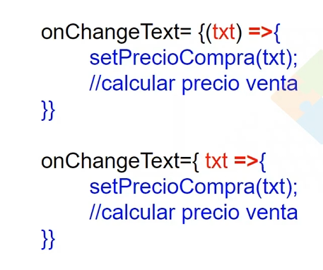
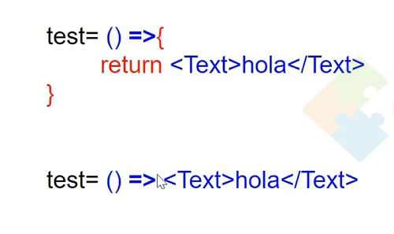
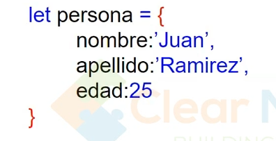
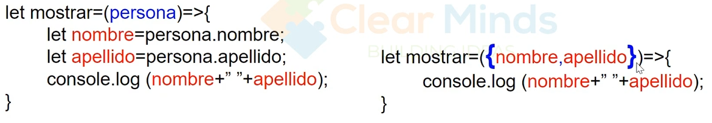

# Detalles
## parentesis en arrow function
+ se puede omitir los parantesis siempre y cuando reciban un parametro

+ se puede mitir las llaves si es un solo retorno

## destructuracion de objetos
en la destructuracion de objetos, se crea variables con el mismo nombre de los atributos del objetos , pero deben tener el mismo nombre de los atributos


## funcion render y componentes declarados
+ forma clasica de un retorno tsx para el render (elementos de React native)
```typescript
        <FlatList
        data={productos}
        renderItem={({ item, index }) => (
          <View style={styles.card}>
            <Text style={styles.index}>#{index + 1}</Text>
            <Text style={styles.nombre}>{item.nombre}</Text>
            <Text style={styles.apellido}>({item.categoria})</Text>
            <Text style={styles.apellido}> USD {item.precio}</Text>
          </View>
        )}
        keyExtractor={(obj) => obj.id}
      /> 

```
+ como se debe hacer `CompPropioProductos` definido previamente

```typescript
        <FlatList
          data={productos}
          renderItem={({ item, index }) => (
            <CompPropioProductos
              nombre={item.nombre}
              categoria={item.categoria}
              precio={item.precio}
              id={item.id}
              index={index}
            />
          )}
          keyExtractor={(obj) => obj.id}
        />
```

## Use State

Para usar variables para cambiios es tiempo real

🔎 Cómo funciona en React
Cada vez que tu componente se re-renderiza, todo el código dentro de la función HomeScreen se vuelve a ejecutar desde cero.

Eso significa que cualquier variable declarada con let o const dentro del componente (fuera de un useState o useRef) se reinicia en cada render.

`import { useState } from 'react';`

- strings

```typescript
const [precioUS, setPrecio] = useState("");   // siempre string
const [idCajaUS, setId] = useState("");       // siempre string
// Y cuando asignas valores numéricos, conviertes:
setPrecio(String(precio));
setId(String(index));
```

- Numericos

```typescript
const [precioUS, setPrecio] = useState("");   // siempre string
const [idCajaUS, setId] = useState("");       // siempre string

///Y en el TextInput
<TextInput
  value={String(precioUS)}   // 👈 conversión aquí
  onChangeText={(txt) => setPrecio(Number(txt))}
/>

```

- Arreglos
```typescript
  const [productos, setProductos] = useState([
  { nombre: "galletas", categoria: "Alimento", precio: 1, id: "97864" },
  { nombre: "TV", categoria: "Entretenimiento", precio: 200, id: "8798" },
  { nombre: "Toalla", categoria: "Limpieza", precio: 8, id: "16289" }
]);

///
    setProductos([...productos, nuevoProducto]); // 👈 crea copia y actualiza
```


